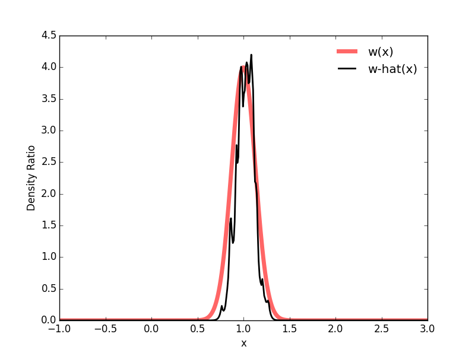
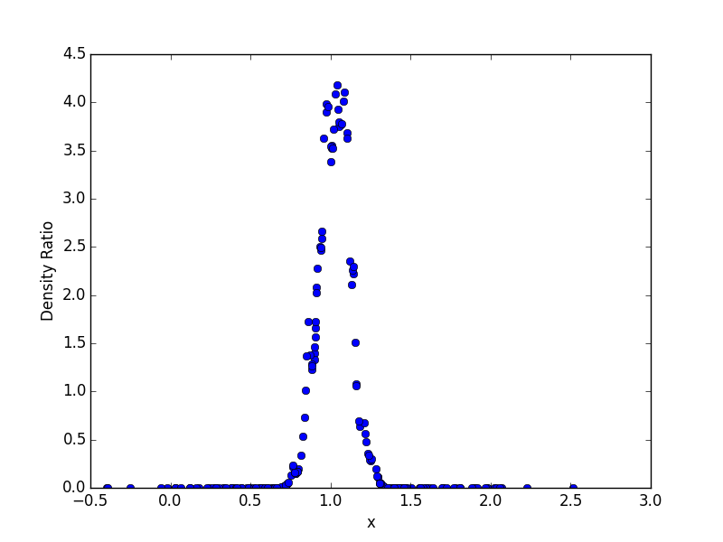
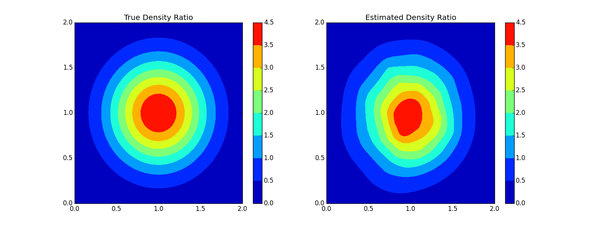

# A Python Package for Density Ratio Estimation
Koji MAKIYAMA (@hoxo_m)  


[](https://travis-ci.org/hoxo-m/densratio_py)
[](https://coveralls.io/github/hoxo-m/densratio_py?branch=master)

## 1. Overview

**Density ratio estimation** is described as follows: for given two data samples `x` and `y` from unknown distributions `p(x)` and `q(y)` respectively, estimate `w(x) = p(x) / q(x)`, where `x` and `y` are d-dimensional real numbers.

The estimated density ratio function `w(x)` can be used in many applications such as the inlier-based outlier detection [1] and covariate shift adaptation [2].
Other useful applications about density ratio estimation were summarized by Sugiyama et al. (2012) [3].

The package **densratio** provides a function `densratio()` that returns a result has the function to estimate density ratio `compute_density_ratio()`.

For example, 


```python
from numpy import random
from scipy.stats import norm
from densratio import densratio

random.seed(1)
x = norm.rvs(size = 200, loc = 1, scale = 1./8)
y = norm.rvs(size = 200, loc = 1, scale = 1./2)
result = densratio(x, y)
print(result)
```


```
#> Method: uLSIF
#> 
#> Kernel Information:
#>   Kernel type: Gaussian RBF
#>   Number of kernels: 100
#>   Bandwidth(sigma): 0.1
#>   Centers: array([ 1.04719547, 0.98294441, 1.06190142, 1.14145367, 1.18276349,..
#> 
#> Kernel Weights(alpha):
#>   array([ 0.25340775, 0.40951303, 0.27002649, 0.17998821, 0.14524305,..
#> 
#> Regularization Parameter(lambda): 0.1
#> 
#> The Function to Estimate Density Ratio:
#>   compute_density_ratio(x)
```

In this case, the true density ratio `w(x)` is known, so we can compare `w(x)` with the estimated density ratio `w-hat(x)`.


```python
from matplotlib import pyplot as plt
from numpy import linspace

def true_density_ratio(x):
    return norm.pdf(x, 1, 1./8) / norm.pdf(x, 1, 1./2)

def estimated_density_ratio(x):
    return result.compute_density_ratio(x)

x = linspace(-1, 3, 400)
plt.plot(x, true_density_ratio(x), "r-", lw=5, alpha=0.6, label="w(x)")
plt.plot(x, estimated_density_ratio(x), "k-", lw=2, label="w-hat(x)")
plt.legend(loc="best", frameon=False)
plt.xlabel("x")
plt.ylabel("Density Ratio")
plt.show()
```



## 2. How to Install

You can install the package from GitHub.

```:sh
$ pip install git+https://github.com/hoxo-m/densratio_py.git
```

The source code for **densratio** package is available on GitHub at

- https://github.com/hoxo-m/densratio_py.

## 3. Details

### 3.1. Basics

The package provides `densratio()` that the result has the function to estimate density ratio.

For data samples `x` and `y`,


```r
from scipy.stats import norm
from densratio import densratio

x = norm.rvs(size = 200, loc = 1, scale = 1./8)
y = norm.rvs(size = 200, loc = 1, scale = 1./2)
result = densratio(x, y)
```

In this case, `result.compute_density_ratio()` can compute estimated density ratio.  


```r
from matplotlib import pyplot as plt

plt.plot(y, result.compute_density_ratio(y), "o")
plt.xlabel("x")
plt.ylabel("Density Ratio")
plt.show()
```



### 3.2. The Method

The package estimates density ratio by the uLSIF method.

- **uLSIF** (unconstrained Least-Squares Importance Fitting) is the default method.
This algorithm estimates density ratio by minimizing the squared loss.
You can find more information in Hido et al. (2011) [1].

The method assume that the denity ratio is represented by linear model: 

`w(x) = alpha1 * K(x, c1) + alpha2 * K(x, c2) + ... + alphab * K(x, cb)`

where `K(x, c) = exp(- ||x - c||^2 / (2 * sigma ^ 2))` is the Gaussian RBF.

`densratio()` performs the two main jobs:

- First, deciding kernel parameter `sigma` by cross validation,
- Second, optimizing kernel weights `alpha`.

As the result, you can obtain `compute_density_ratio()`.

### 3.3. Result and Paremeter Settings

`densratio()` outputs the result like as follows:


```
#> Method: uLSIF
#> 
#> Kernel Information:
#>   Kernel type: Gaussian RBF
#>   Number of kernels: 100
#>   Bandwidth(sigma): 0.1
#>   Centers: array([ 1.04719547, 0.98294441, 1.06190142, 1.14145367, 1.18276349,..
#> 
#> Kernel Weights(alpha):
#>   array([ 0.25340775, 0.40951303, 0.27002649, 0.17998821, 0.14524305,..
#> 
#> Regularization Parameter(lambda): 0.1
#> 
#> The Function to Estimate Density Ratio:
#>   compute_density_ratio(x)
```

- **Method** is fixed by uLSIF.
- **Kernel type** is fixed by Gaussian RBF.
- **Number of kernels** is the number of kernels in the linear model. You can change by setting `kernel_num` parameter. In default, `kernel_num = 100`.
- **Bandwidth(sigma)** is the Gaussian kernel bandwidth. In default, `sigma = None`, the algorithms automatically select the optimal value by cross validation. If you set `sigma` a number, that will be used. If you set a numeric vector, the algorithms select the optimal value in them by cross validation.
- **Centers** are centers of Gaussian kernels in the linear model. These are selected at random from the data sample `x` underlying a numerator distribution `p(x)`. You can find the whole values in `result.kernel_info.centers`. 
- **Kernel weights(alpha)** are alpha parameters in the linear model. It is optimaized by the algorithms. You can find the whole values in `result.alpha`. 
- **The Funtion to Estimate Density Ratio** is named `compute_density_ratio()`.

## 4. Multi Dimensional Data Samples

In the above, the input data samples `x` and `y` were one dimensional.
`densratio()` allows to input multidimensional data samples as `matrix`.

For example,


```python
from numpy import random
from scipy.stats import multivariate_normal
from densratio import densratio

random.seed(3)
x = multivariate_normal.rvs(size = 3000, mean = [1, 1], cov = [[1./8, 0], [0, 1./8]])
y = multivariate_normal.rvs(size = 3000, mean = [1, 1], cov = [[1./2, 0], [0, 1./2]])
result = densratio(x, y)
print(result)
```


```
#> Method: uLSIF
#> 
#> Kernel Information:
#>   Kernel type: Gaussian RBF
#>   Number of kernels: 100
#>   Bandwidth(sigma): 0.316227766017
#>   Centers: array([[ 1.06481062, 1.09768368],..
#> 
#> Kernel Weights(alpha):
#>   array([ 0.19009526, 0.18680918, 0.20764146, 0.19914001, 0.21313236,..
#> 
#> Regularization Parameter(lambda): 0.0316227766017
#> 
#> The Function to Estimate Density Ratio:
#>   compute_density_ratio(x)
```

Also in this case, we can compare the true density ratio with the estimated density ratio.


```python
from matplotlib import pyplot as plt
from numpy import linspace, dstack, meshgrid, concatenate

def true_density_ratio(x):
    return multivariate_normal.pdf(x, [1., 1.], [[1./8, 0], [0, 1./8]]) / \
           multivariate_normal.pdf(x, [1., 1.], [[1./2, 0], [0, 1./2]])

def estimated_density_ratio(x):
    return result.compute_density_ratio(x)

range_ = linspace(0, 2, 200)
grid = concatenate(dstack(meshgrid(range_, range_)))
levels = [0, 0.5, 1, 1.5, 2, 2.5, 3, 3.5, 4.5]

plt.subplot(1, 2, 1)
plt.contourf(range_, range_, true_density_ratio(grid).reshape(200, 200), levels)
plt.colorbar()
plt.title("True Density Ratio")
plt.subplot(1, 2, 2)
plt.contourf(range_, range_, estimated_density_ratio(grid).reshape(200, 200), levels)
plt.colorbar()
plt.title("Estimated Density Ratio")
plt.show()
```



The dimensions of `x` and `y` must be same.

## 5. References

[1] Hido, S., Tsuboi, Y., Kashima, H., Sugiyama, M., & Kanamori, T. 
**Statistical outlier detection using direct density ratio estimation.**
Knowledge and Information Systems 2011. 

[2] Sugiyama, M., Nakajima, S., Kashima, H., von Bünau, P. & Kawanabe, M. 
**Direct importance estimation with model selection and its application to covariate shift adaptation.** NIPS 2007.

[3] Sugiyama, M., Suzuki, T. & Kanamori, T. 
**Density Ratio Estimation in Machine Learning.**
Cambridge University Press 2012.
